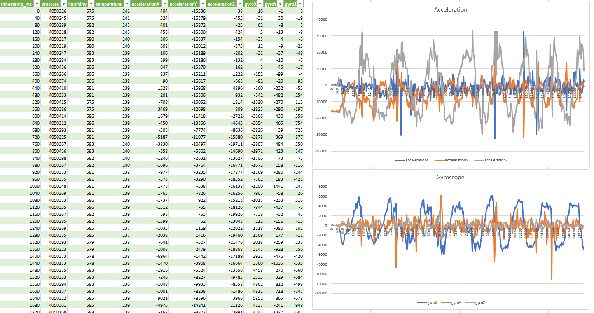

# BlueTile_SensorValues
Firmware for the ST BlueTile Evaluation Board that streams sensor values over Bluetooth, plus a Companion Python App for Linux to read them and save everything inside csv files.

  

## What does the Firmware do?
 1. Initialize the platform.
 3. Start Bluetooth, GAP and GATT framework. Define a personalized GATT service and a GATT characteristic to publish values on.
 4. Make the device visible and connectable.
 5. A timer in the BlueTile is set to poll the sensors every 0.04s. Every 1s, all samples are published over Bluetooth using GATT characteristics. 
 6. The GATT characteristic can be read from a smartphone (using an app like nRF Connect on Android), or can be read from the companion Linux app provided. The provided application can save all the sampled data inside a .csv file, ready to be transformed into graphs.  

## How to build, compile and get the firmware.
1. Get KEIL uVision for ST Microelectronics from https://www2.keil.com/stmicroelectronics-stm32/mdk and activate it as explained. 
2. Install on KEIL the Software Pack for the BlueNRG-2.
3. Get the Software Development Kit for the ST BlueTile from https://www.st.com/en/evaluation-tools/steval-bcn002v1b.html#tools-software
4. Unpack the SDK just downloaded, go to Project -> BLE_Examples -> BLE_SensorDemo and replace the existing folders with the ones from here. EWARM and TrueStudio folders are not necessary, as we're using uVision. 
5. Go inside the MDK-ARM folder, and open the uVision project. It will load everything, including the libraries from ST that are included in the SDK. 
6. Compile everything: you will get an .hex file in the MDK-ARM folder (or a subfolder). Use the ST RF-Flasher Utility from https://www.st.com/en/embedded-software/stsw-bnrgflasher.html to flash the HEX file (not the BIN!) to the board. 
7. The blue LED will turn on on the board and the device will be visible to any Bluetooth device. Use the nRF Android App or the Linux App provided :)
8. If something went wrong, flash another .hex file from the SDK, for example the ResetManager (Firmware -> BLE_Examples -> BLE_OTA_ResetManager) and then flash your .hex again. This has something to do with the OTA system from ST. https://community.st.com/s/question/0D50X0000BB0RlUSQV/unable-to-run-precompiled-firmware-on-bluetile-stevalbcn002v1

## Companion app.
The companion app is written in Python and is based on the BLE_GATT library. https://github.com/ukBaz/BLE_GATT
Please refer to them to find all the necessary dependencies. To sum up:
1. Make sure Python and BlueZ are installed in your system. 
2. Install the library using the command `sudo pip install BLE_GATT`
3. Launch the Linux app by issuing `python ReadValuesApp.py`
4. It will launch, ask you how many seconds you want to sample, create the csv file and then return.
5. Maybe you need to modify the bluetooth address for it to work correctly. 

## Tips for working with the BlueTile
1. Read the BlueNRG2 Programming Guidelines from ST: https://www.st.com/resource/en/programming_manual/dm00294449-bluenrg1-bluenrg2-ble-stack-v2x-programming-guidelines-stmicroelectronics.pdf
2. Use the ST Tool that generates the configuration file for the BlueNRG2: https://www.st.com/content/st_com/en/products/embedded-software/evaluation-tool-software/stsw-bluenrg1-dk.html
3. Download the nRF Connect app for Android: https://play.google.com/store/apps/details?id=no.nordicsemi.android.mcp
